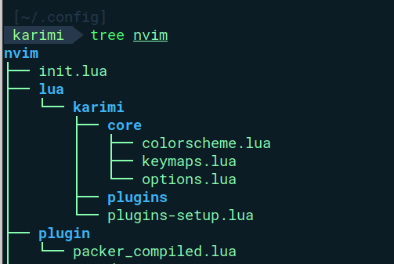

# neovim-config
Neovim configurations for my ideal dev work environment.

## Basic File Structure
Begin by creating `.config` folder `mkdir ~/.config` in your `~` _directory_. Navigate to this folder and create folders to reflect the attached sstructure\:

### Tshoot
If you would wish to rest your configs, delete the Neovim's **'data'** directory. By default it is `~/.local/share/nvim`

